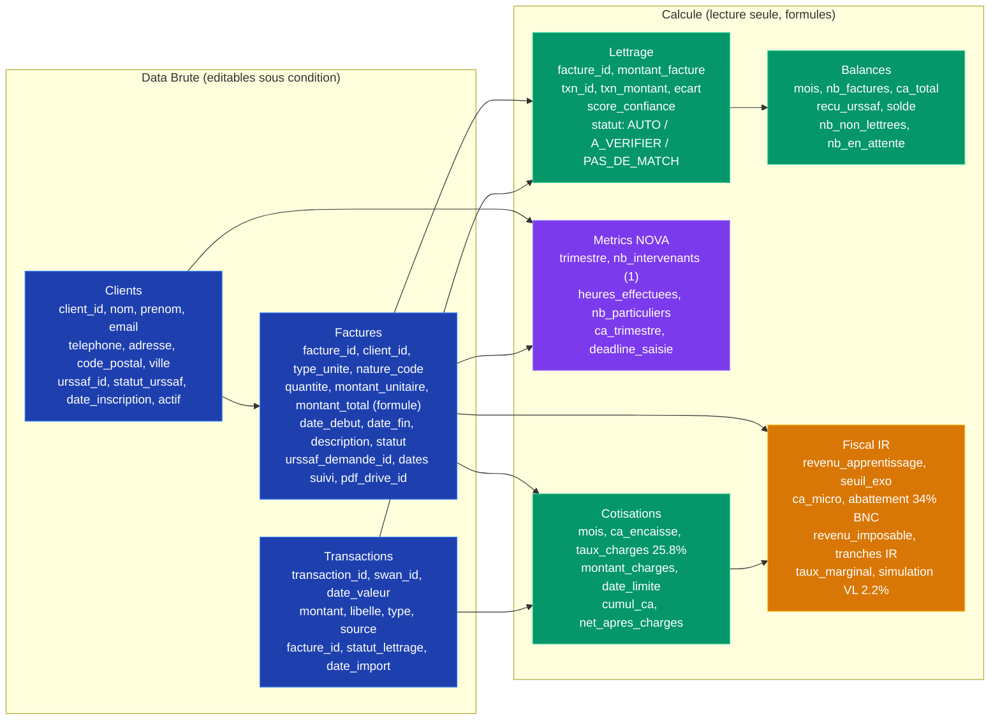

# Modèle de Données — SAP-Facture

**Version:** 1.0
**Date:** 15 mars 2026
**Auteur:** Jules Willard
**Source de vérité:** docs/schemas/SCHEMAS.html — SCHEMA 5

---

## Résumé Exécutif

SAP-Facture utilise **Google Sheets comme backend de données**, structuré en **8 onglets** :
- **3 onglets data brute** : Clients, Factures, Transactions (éditables sous contrôle)
- **5 onglets calculés** : Lettrage, Balances, Metrics NOVA, Cotisations, Fiscal IR (formules Excel/Sheets)

**Volume attendu :**
- 4 à 10 clients actifs
- 15 à 50 factures par mois
- 10 à 30 transactions bancaires par mois

**Architecture :**
- Les onglets data brute sont modifiés par l'application via l'API Google Sheets v4
- Les onglets calculés utilisent des formules (VLOOKUP, SUMIF, etc.) en lecture seule
- Les formules de lettrage auto, scoring confiance, et calcul fiscal sont les "cerveaux" du système

---

## 1. ONGLET 1 : CLIENTS (Data Brute)

**Statut:** Éditable par l'application et manuellement par Jules
**Clé primaire:** `client_id` (UUID ou séquence)
**Volume:** 4 à 10 lignes
**Utilisation:** Source de vérité pour les identités URSSAF

### Colonnes

| Colonne | Type | Obligatoire | Éditable | Description | Exemple | Notes |
|---------|------|-------------|----------|-------------|---------|-------|
| `client_id` | Texte (UUID) | OUI | NON | Identifiant unique alphanumérique | `CLT-001` ou UUID-v4 | Généré à la création, immutable |
| `nom` | Texte | OUI | OUI | Nom de famille ou dénomination | Dupont | Sensibilité casse respectée |
| `prenom` | Texte | NON | OUI | Prénom du client | Jean | Vide pour entités |
| `email` | Email | OUI | OUI | Adresse email officielle | jean.dupont@email.fr | Validation format RFC5322 |
| `telephone` | Texte | NON | OUI | Numéro de mobile ou fixe | +33612345678 | Stocké sans normalisation (app valide) |
| `adresse` | Texte | NON | OUI | Numéro + rue complète | 123 Rue de la Paix, Paris | Peut être sur 1-2 colonnes |
| `code_postal` | Texte | NON | OUI | Code postal (5 chiffres FR) | 75001 | Validation France ou EU |
| `ville` | Texte | NON | OUI | Ville/commune | Paris | Optionnel si adresse complète |
| `urssaf_id` | Texte | NON | NON | ID technique URSSAF reçu du portail | `id_tech_xyz123` | Vide avant 1ère inscription |
| `statut_urssaf` | Texte | OUI | NON | Statut d'inscription URSSAF | `INSCRIT`, `EN_ATTENTE`, `ERREUR`, `SUSPENDU` | Maj par polling API |
| `date_inscription` | Date | OUI | NON | Date d'inscription URSSAF | 2026-01-15 | Format ISO 8601 |
| `date_maj` | Date | OUI | NON | Dernière mise à jour (par app ou manuel) | 2026-03-15 | Auto-rempli par l'app |
| `actif` | Booléen | OUI | OUI | Client actif ou archivé | VRAI ou FAUX | VRAI = peut créer factures |

### Contraintes & Règles

- **Unicité email** : Un seul client par email (ou relaxé si alias)
- **Unicité urssaf_id** : Un seul client par ID URSSAF (API interne)
- **Validation email** : Format stricte (RFC5322), doublons bloqués
- **Statuts valides** : INSCRIT, EN_ATTENTE, ERREUR, SUSPENDU
  - `INSCRIT` : prêt à créer des factures
  - `EN_ATTENTE` : inscription API en cours, bloque les factures
  - `ERREUR` : problème lors de l'inscription (payload invalide, etc.)
  - `SUSPENDU` : désactivé manuellement par Jules
- **Archivage** : Passé à `actif = FAUX` pour supression logique (factures antérieures restent visibles)

### Exemples de Données

```
client_id  | nom      | prenom | email           | telephone     | adresse                | code_postal | ville   | urssaf_id      | statut_urssaf | date_inscription | date_maj   | actif
-----------|----------|--------|-----------------|---------------|------------------------|-------------|---------|----------------|---------------|------------------|------------|-------
CLT-001    | Dupont   | Jean   | j.dupont@mail.fr | +33612345678 | 123 Rue Paix, Paris   | 75001       | Paris   | id_tech_abc123 | INSCRIT       | 2026-01-15       | 2026-03-10 | VRAI
CLT-002    | Martin   | Marie  | m.martin@mail.fr | +33687654321 | 456 Avenue Liberté     | 69000       | Lyon    |                | EN_ATTENTE    | 2026-03-14       | 2026-03-14 | VRAI
CLT-003    | Durand   | Pierre | (suppression)    |               |                        |             |         | id_tech_xyz789 | INSCRIT       | 2025-12-01       | 2026-02-01 | FAUX
```

### Interdépendances

- **Factures** : Clé étrangère `client_id` → Clients.client_id
- **Lettrage** : Lookup sur nom/email pour affichage dans rapprochements
- **Metrics NOVA** : COUNT(DISTINCT client_id) pour "nb_particuliers"

---

## 2. ONGLET 2 : FACTURES (Data Brute)

**Statut:** Éditable par l'application (créée via UI/CLI)
**Clé primaire:** `facture_id` (UUID ou séquence)
**Volume:** 15 à 50 lignes/mois
**Utilisation:** Centre névralgique du flux de facturation

### Colonnes

| Colonne | Type | Obligatoire | Éditable | Description | Exemple | Notes |
|---------|------|-------------|----------|-------------|---------|-------|
| `facture_id` | Texte (UUID) | OUI | NON | Identifiant unique facturation | `FAC-2026-001` ou UUID | Généré lors de création |
| `client_id` | Texte (FK) | OUI | NON | Référence à Clients.client_id | CLT-001 | Immuable après création |
| `type_unite` | Texte | OUI | OUI | Unité de facturation | `HEURE`, `JOUR`, `FORFAIT`, `SEANCE` | Enum pour validation |
| `nature_code` | Texte | OUI | OUI | Code URSSAF de la prestation | `COURS_PARTICULIER`, `BABY_SITTING`, `AIDE_MENAGE` | Enum restreint |
| `quantite` | Nombre | OUI | OUI | Nombre d'heures/jours/forfaits | 10 (heures) | Décimal (1 décimale) |
| `montant_unitaire` | Devise (EUR) | OUI | OUI | Tarif à l'unité TTC | 35.00 | Précision 2 décimales |
| `montant_total` | Devise (EUR) | OUI | NON | = quantite × montant_unitaire | 350.00 | **FORMULE** (lecture seule) |
| `date_debut` | Date | OUI | OUI | Première date de prestation | 2026-03-01 | Format ISO 8601 |
| `date_fin` | Date | OUI | OUI | Dernière date de prestation | 2026-03-15 | >= date_debut |
| `description` | Texte libre | NON | OUI | Notes libres (objet facture) | "Cours maths hebdo" | Max 500 caractères |
| `statut` | Texte (enum) | OUI | NON | État du cycle de vie facture | BROUILLON, SOUMIS, CREE, EN_ATTENTE, VALIDE, PAYE, RAPPROCHE, ANNULE, ERREUR, REJETE, EXPIRE | Maj par polling API |
| `urssaf_demande_id` | Texte | NON | NON | ID retourné par URSSAF POST /demandes-paiement | `demande_xyz789` | Vide jusqu'à soumission |
| `date_creation` | Date-heure | OUI | NON | Timestamp de création facture (app) | 2026-03-01 10:30:00 | Généré auto par app |
| `date_soumis` | Date-heure | NON | NON | Timestamp soumission URSSAF | 2026-03-01 10:35:00 | Auto-maj lors POST API |
| `date_cree` | Date-heure | NON | NON | Timestamp réponse URSSAF (statut=CREE) | 2026-03-01 10:36:00 | Maj lors GET polling |
| `date_valide` | Date-heure | NON | NON | Timestamp client valide sur portail URSSAF | 2026-03-02 14:20:00 | Maj lors GET polling |
| `date_paye` | Date-heure | NON | NON | Timestamp URSSAF a viré l'argent | 2026-03-05 09:15:00 | Maj lors GET polling |
| `pdf_drive_id` | Texte | NON | NON | ID Google Drive du PDF généré | `file_abc123def456` | Stocké pour re-télécharger |
| `pdf_url` | URL | NON | NON | URL partage public du PDF | `https://drive.google.com/...` | Généré après création PDF |
| `notes_erreur` | Texte libre | NON | OUI | Messages d'erreur URSSAF ou validation | "Email client invalide" | Maj lors erreur API |

### Statuts & Transitions (Machine à États)

```
[START]
   ↓
BROUILLON
   ├→ SOUMIS → CREE → EN_ATTENTE → VALIDE → PAYE → RAPPROCHE → [END]
   │                       ↑                                      (OK)
   │                       └─ REMINDER T+36h
   │                       └─ EXPIRE (48h) → BROUILLON (re-soumettre)
   │                       └─ REJETE → BROUILLON (corriger)
   ├→ ERREUR (payload invalide) → BROUILLON (corriger)
   ├→ ANNULE → [END] (suppression logique)
   └→ [Modifiable : montant, dates, client]

SOUMIS → CREE : API URSSAF accepte
CREE → EN_ATTENTE : Email envoyé au client
EN_ATTENTE → VALIDE : Client valide (portail URSSAF)
EN_ATTENTE → EXPIRE : 48h sans validation
EN_ATTENTE → REJETE : Client refuse
VALIDE → PAYE : URSSAF effectue virement
PAYE → RAPPROCHE : Matched avec transaction Swan
```

### Contraintes & Règles

- **Validation montant** : > 0, <= 50 000 EUR (limite URSSAF)
- **Validation quantité** : > 0, <= 1 000 (protection contra flood)
- **Dates cohérence** : `date_fin >= date_debut`
- **Statut immuable** : Une fois RAPPROCHE, la facture est figée
- **client_id immuable** : Pas de changement après création
- **Clé étrangère client_id** : Référence à Clients.client_id (INSCRIT pour créer)
- **Duplication check** : Bloque création si facture identique (même client, dates, montant) dans les 5 derniers jours
- **Reminder automatique** : T+36h sans validation = email rappel à Jules (pas auto-submit)
- **Expiration** : EN_ATTENTE > 48h → automatiquement EXPIRE (polling détecte)

### Exemples de Données

```
facture_id | client_id | type_unite | nature_code      | quantite | montant_unitaire | montant_total | date_debut | date_fin   | statut    | urssaf_demande_id | date_creation      | pdf_drive_id
-----------|-----------|------------|------------------|----------|------------------|---------------|------------|------------|-----------|-------------------|--------------------|-----------------------
FAC-001    | CLT-001   | HEURE      | COURS_PARTICULIER | 10       | 35.00            | 350.00        | 2026-03-01 | 2026-03-15 | RAPPROCHE | dem_xyz123        | 2026-03-01 10:30:00| file_abc123
FAC-002    | CLT-001   | HEURE      | COURS_PARTICULIER | 5        | 35.00            | 175.00        | 2026-03-16 | 2026-03-20 | EN_ATTENTE| dem_abc456        | 2026-03-20 14:00:00| file_def456
FAC-003    | CLT-002   | SEANCE     | BABY_SITTING     | 1        | 150.00           | 150.00        | 2026-03-22 | 2026-03-22 | BROUILLON |               | 2026-03-22 18:45:00|
```

### Interdépendances

- **Clients** : Clé étrangère `client_id`
- **Lettrage** : Les factures PAYE sont matchées avec Transactions
- **Balances** : Agrégation CA par mois
- **Metrics NOVA** : Heures et clients pour reporting trimestriel
- **Cotisations** : CA encaissé pour calcul charges mensuelles
- **Fiscal IR** : CA HT pour simulation IR annuelle

---

## 3. ONGLET 3 : TRANSACTIONS (Data Brute)

**Statut:** Éditable par l'application (import via Swan API)
**Clé primaire:** `transaction_id` (Swan ID ou UUID)
**Volume:** 10 à 30 lignes/mois
**Utilisation:** Enregistrement des virements bancaires (Swan/Indy)

### Colonnes

| Colonne | Type | Obligatoire | Éditable | Description | Exemple | Notes |
|---------|------|-------------|----------|-------------|---------|-------|
| `transaction_id` | Texte (UUID) | OUI | NON | Identifiant unique bancaire | `txn_swan_abc123def456` ou UUID interne | Généré lors import Swan |
| `swan_id` | Texte | OUI | NON | ID transaction retourné par Swan GraphQL | `00000000-0000-0000-0000-000000000001` | Immuable |
| `date_valeur` | Date | OUI | NON | Date de comptabilisation bancaire | 2026-03-05 | Format ISO 8601 |
| `montant` | Devise (EUR) | OUI | NON | Montant du virement en EUR | 350.00 | Toujours positif (URSSAF → Jules) |
| `libelle` | Texte | OUI | NON | Description bancaire brute | "VIR URSSAF DUE00123456789 JEAN DUPONT" | Peut contenir données utiles |
| `type` | Texte (enum) | OUI | NON | Type de transaction | `VIREMENT_RECU`, `FRAIS`, `INTERET` | Enum restreint |
| `source` | Texte | OUI | NON | Provenance de la transaction | `URSSAF`, `CLIENT_DIRECT`, `AUTRE` | Pour filtrage analytique |
| `facture_id` | Texte (FK) | NON | NON | Référence à Factures.facture_id (si matchée) | FAC-001 | Vide jusqu'à lettrage |
| `statut_lettrage` | Texte (enum) | OUI | NON | État du rapprochement | `LETTREE`, `A_VERIFIER`, `PAS_DE_MATCH` | Maj par formule Lettrage |
| `score_confiance` | Nombre (0-100) | NON | NON | Confiance match (formule) | 95 | Calculé par onglet Lettrage |
| `date_import` | Date-heure | OUI | NON | Timestamp import depuis Swan | 2026-03-05 09:30:00 | Auto-rempli par app |

### Contraintes & Règles

- **Montant positif** : Virements reçus uniquement (depuis URSSAF)
- **Unicité Swan ID** : Un seul par swan_id (API Swan interne)
- **Sources valides** : URSSAF, CLIENT_DIRECT, AUTRE
- **Types valides** : VIREMENT_RECU, FRAIS, INTERET, PRELEVEMENT
- **Date cohérence** : date_valeur >= date_import - 5 jours (délai bancaire)
- **facture_id** : Immuable après lettrage AUTO (score >= 80)
- **Duplication** : Bloque import si swan_id existe déjà
- **Fenêtre de matching** : Facture PAYE ± 5 jours (voir Lettrage)

### Exemples de Données

```
transaction_id | swan_id                            | date_valeur | montant | libelle                        | type           | source | facture_id | statut_lettrage | score_confiance | date_import
---------------|-------------------------------------|-------------|---------|--------------------------------|----------------|--------|------------|-----------------|-----------------|-------------------
TXN-001        | 00000000-0000-0000-0000-000000001 | 2026-03-05  | 350.00  | VIR URSSAF DUE00001 DUPONT    | VIREMENT_RECU  | URSSAF | FAC-001    | LETTREE         | 95              | 2026-03-05 10:30
TXN-002        | 00000000-0000-0000-0000-000000002 | 2026-03-21  | 175.00  | VIR URSSAF DUE00002           | VIREMENT_RECU  | URSSAF |            | A_VERIFIER      | 65              | 2026-03-21 09:15
TXN-003        | 00000000-0000-0000-0000-000000003 | 2026-03-15  | 12.50   | FRAIS BANCAIRES MARS           | FRAIS          | AUTRE  |            | PAS_DE_MATCH    |                 | 2026-03-15 16:00
```

### Interdépendances

- **Factures** : Clé étrangère `facture_id` (opcional, remplie par Lettrage)
- **Lettrage** : Source d'input pour matching ; score_confiance et statut_lettrage calculés par Lettrage
- **Balances** : Agrégation montant par mois pour solde caisse

---

## 4. ONGLET 4 : LETTRAGE (Calculé — Formules)

**Statut:** Lecture seule (formules automatiques)
**Source:** Factures (PAYE) + Transactions (importées)
**Logique:** Matching automatique avec scoring confiance
**Utilisation:** Rapprochement bancaire

### Colonnes

| Colonne | Type | Formule/Logique | Description | Exemple | Notes |
|---------|------|-----------------|-------------|---------|-------|
| `lettrage_id` | Texte | Manuelle (index) | Clé de ligne (1, 2, 3...) | 1 | Pour référence |
| `facture_id` | Texte (FK) | FILTER(Factures, statut=PAYE) | Facture matchée ou en test | FAC-001 | Immuable |
| `montant_facture` | Devise | =Factures!montant_total | Montant TTC facture | 350.00 | Exact du SCHEMA 2 |
| `txn_id` | Texte (FK) | Proposé par algo matching | Transaction bancaire proposée | TXN-001 | Vide si pas de match |
| `txn_montant` | Devise | =Transactions!montant (si match) | Montant du virement reçu | 350.00 | Peut ≠ montant_facture (frais, retenue) |
| `ecart` | Devise | =ABS(montant_facture - txn_montant) | Différence absolue | 0.00 | > 0 = discordance |
| `score_confiance` | Nombre (0-100) | Scoring algo (voir ci-dessous) | Confiance du match | 95 | Calcul multi-critères |
| `statut` | Texte (enum) | Logique (basée score) | État du matching | AUTO, A_VERIFIER, PAS_DE_MATCH | Maj auto ou manuel |
| `date_maj` | Date-heure | NOW() ou manuelle | Dernière mise à jour | 2026-03-05 10:30:00 | Maj lors changement statut |

### Logique de Scoring Confiance

**Scoring :** 0-100 points pour décider AUTO / A_VERIFIER / PAS_DE_MATCH

```
Score = 0 (départ)

1. MONTANT EXACT (50 pts)
   Si montant_facture == txn_montant → +50
   Sinon si écart < 1 EUR → +25
   Sinon → 0 pts

2. DATE PROXIMITÉ (30 pts)
   Si |date_paiement - date_valeur| <= 0 jours (même jour) → +30
   Sinon si <= 1 jour → +25
   Sinon si <= 3 jours → +15
   Sinon si <= 5 jours → +5
   Sinon → 0 pts

3. LIBELLÉ URSSAF (20 pts)
   Si libelle CONTIENT "URSSAF" → +20
   Sinon si CONTIENT "DUE" → +10
   Sinon → 0 pts

SEUILS :
- Score >= 80 → AUTO (confiance haute, match auto-validé)
- Score 50-79 → A_VERIFIER (ambiguïté, Jules confirme)
- Score < 50 → PAS_DE_MATCH (probable no-match)
```

### Règles de Matching

```
Pour chaque facture PAYE :
1. Fenêtre dates : facture date_paiement ± 5 jours
2. Filtrer transactions dans fenêtre
3. Chercher 1 transaction où :
   - montant proche (écart < 5 EUR)
   - libelle ~ URSSAF
4. Calculer score_confiance
5. Si score >= 80 : AUTO
   Sinon si score >= 50 : A_VERIFIER (surligné orange dans Sheets)
   Sinon : PAS_DE_MATCH (surligné rouge)
6. Écrire facture_id dans Transactions.facture_id (si AUTO)
7. Maj Balances (solde, nb_lettrees)
```

### Exemples de Données

```
facture_id | montant_facture | txn_id | txn_montant | ecart | score_confiance | statut       | date_maj
-----------|-----------------|--------|-------------|-------|-----------------|--------------|-------------------
FAC-001    | 350.00          | TXN-001| 350.00      | 0.00  | 95              | AUTO         | 2026-03-05 10:30
FAC-002    | 175.00          | TXN-002| 175.00      | 0.00  | 65              | A_VERIFIER   | 2026-03-21 09:15
FAC-003    | 150.00          |        |             |       | 0               | PAS_DE_MATCH | 2026-03-22 18:45
```

### Interdépendances

- **Factures** : Filtre statut=PAYE, lookup montant et dates
- **Transactions** : Matching et score
- **Balances** : Met à jour nb_lettrees et nb_non_lettrees

---

## 5. ONGLET 5 : BALANCES (Calculé — Formules)

**Statut:** Lecture seule (agrégations SUMIF, COUNTIF)
**Source:** Factures + Lettrage + Transactions
**Logique:** Soldes et KPIs comptables par mois
**Utilisation:** Dashboard, suivi caisse, reporting

### Colonnes

| Colonne | Type | Formule | Description | Exemple | Notes |
|---------|------|---------|-------------|---------|-------|
| `mois` | Mois (YYYY-MM) | Manuelle ou ROW() | Période (01/2026, 02/2026, etc.) | 2026-03 | Format ISO YYYY-MM |
| `nb_factures` | Nombre | =COUNTIFS(Factures!date_creation,">=1/3/26","<4/1/26") | Nombre factures créées ce mois | 3 | Toutes, tous statuts |
| `nb_factures_payees` | Nombre | =COUNTIFS(Factures!statut,"PAYE",Factures!date_paye,">=..." | Factures état PAYE ce mois | 2 | date_paye dans mois |
| `ca_total` | Devise | =SUMIFS(Factures!montant_total,...) | Revenu HT/TTC ce mois | 525.00 | Toutes factures datées ce mois |
| `ca_encaisse` | Devise | =SUMIFS(Factures!montant_total,Factures!statut,"PAYE",...) | CA effectivement payé ce mois | 350.00 | Montant reçu URSSAF |
| `recu_urssaf` | Devise | =SUMIFS(Transactions!montant,"source","URSSAF",date_valeur,">=...",...) | Montant virement URSSAF ce mois | 350.00 | Source=URSSAF, date caisse |
| `solde` | Devise | =SUM(recu_urssaf) - frais | Disponibilités caisse | 350.00 | Après frais (si appliqués) |
| `nb_non_lettrees` | Nombre | =COUNTIFS(Lettrage!statut,"PAS_DE_MATCH",...) | Factures sans match ce mois | 1 | À rapprocher manuellement |
| `nb_en_attente` | Nombre | =COUNTIFS(Factures!statut,"EN_ATTENTE",...) | Factures en validation client (48h) | 0 | Rappel T+36h si > 0 |
| `frais_bancaires` | Devise | =SUMIFS(Transactions!montant,Transactions!type,"FRAIS",...) | Frais bank ce mois | 2.50 | Optionnel |

### Exemples de Données

```
mois    | nb_factures | nb_factures_payees | ca_total | ca_encaisse | recu_urssaf | solde  | nb_non_lettrees | nb_en_attente
--------|-------------|--------------------|---------|-----------|-----------|-----------|-----------
2026-01 | 5           | 4                  | 700.00  | 600.00    | 600.00    | 597.50 | 1              | 0
2026-02 | 8           | 7                  | 1050.00 | 1000.00   | 1000.00   | 997.50 | 1              | 0
2026-03 | 3           | 2                  | 525.00  | 350.00    | 350.00    | 350.00 | 1              | 1
```

### Formules Clés (Google Sheets)

```
# Calcul nb_factures (mois = 2026-03)
=COUNTIFS(Factures!date_creation,">=2026-03-01",Factures!date_creation,"<2026-04-01")

# Calcul CA encaissé (factures PAYE ce mois)
=SUMIFS(
  Factures!montant_total,
  Factures!statut,"PAYE",
  Factures!date_paye,">=2026-03-01",
  Factures!date_paye,"<2026-04-01"
)

# Calcul recu_urssaf (virements URSSAF ce mois)
=SUMIFS(
  Transactions!montant,
  Transactions!source,"URSSAF",
  Transactions!date_valeur,">=2026-03-01",
  Transactions!date_valeur,"<2026-04-01"
)

# Lettres non matchées ce mois
=COUNTIFS(
  Lettrage!statut,"PAS_DE_MATCH",
  Lettrage!date_maj,">=2026-03-01",
  Lettrage!date_maj,"<2026-04-01"
)
```

### Interdépendances

- **Factures** : Source de CA et statuts
- **Transactions** : Source de virements reçus
- **Lettrage** : Source de statuts de matching

---

## 6. ONGLET 6 : METRICS NOVA (Calculé — Formules)

**Statut:** Lecture seule (agrégations trimestrielles)
**Source:** Factures + Clients + Lettrage
**Logique:** Reporting NOVA (déclarations trimestrielles URSSAF micro-entrepreneur)
**Utilisation:** Attestations, suivi réglementaire

### Colonnes

| Colonne | Type | Formule | Description | Exemple | Notes |
|---------|------|---------|-------------|---------|-------|
| `trimestre` | Texte (YYYY-Qn) | Manuelle | Période trimestrielle | 2026-Q1 | Format ISO |
| `nb_intervenants` | Nombre | =COUNTA(DISTINCT Clients.client_id) | Nombre de clients uniques ce trimestre | 5 | Pour "nb_particuliers" NOVA |
| `heures_effectuees` | Nombre | =SUMIFS(Factures!quantite,Factures!type_unite,"HEURE",...) | Total heures presta ce trim | 120 | Déduit de quantite/type_unite |
| `nb_particuliers` | Nombre | =nb_intervenants (alias) | Alias pour reporting | 5 | Même que nb_intervenants |
| `ca_trimestre` | Devise | =SUMIFS(Factures!montant_total,date_paiement,"Q1 2026",...) | Revenu brut ce trim | 3500.00 | Factures PAYE |
| `ca_net_charges` | Devise | =ca_trimestre - charges_estimees | CA net des charges URSSAF | 2600.00 | Après 25.8% charges |
| `deadline_saisie` | Date | Manuelle (hardcoded) | Limite déclaration NOVA URSSAF | 2026-04-30 | Fin mois suivant trim |

### Exemples de Données

```
trimestre | nb_intervenants | heures_effectuees | nb_particuliers | ca_trimestre | ca_net_charges | deadline_saisie
----------|-----------------|-------------------|-----------------|-----------|-----------|-----------
2026-Q1   | 5               | 120               | 5               | 3500.00   | 2600.00   | 2026-04-30
2026-Q2   | 6               | 145               | 6               | 4200.00   | 3132.00   | 2026-07-31
```

### Interdépendances

- **Factures** : Source de heures et CA
- **Clients** : Pour DISTINCT count

---

## 7. ONGLET 7 : COTISATIONS (Calculé — Formules)

**Statut:** Lecture seule (formules mensuelles)
**Source:** Factures
**Logique:** Calcul automatique des charges sociales (URSSAF micro-entrepreneur)
**Utilisation:** Budget, suivi charges, provisions

### Colonnes

| Colonne | Type | Formule | Description | Exemple | Notes |
|---------|------|---------|-------------|---------|-------|
| `mois` | Mois (YYYY-MM) | Manuelle | Période mensuelle | 2026-03 | Format ISO YYYY-MM |
| `ca_encaisse` | Devise | =Balances.ca_encaisse | CA HT facturé ce mois | 350.00 | Depuis Balances |
| `taux_charges` | Pourcentage | 25.8% (constant) | Taux URSSAF micro | 25.8% | Taux 2026 |
| `montant_charges` | Devise | =ca_encaisse * taux_charges | Charges sociales dues | 90.30 | À provisionner |
| `date_limite` | Date | Manuelle (hardcoded) | Limite paiement cotisations | 2026-04-15 | 15 du mois suivant |
| `cumul_ca_annuel` | Devise | =SUM(ca_encaisse) depuis janvier | Total CA annuel jusqu'à ce mois | 875.00 | Pour suivi seuils micro |
| `net_apres_charges` | Devise | =ca_encaisse - montant_charges | Disponibilités nettes | 259.70 | CA - charges |
| `seuil_micro` | Devise | 72600 (constant) | Seuil dépassement régime micro | 72600.00 | 2026 (ajusté annuellement) |
| `cumul_vs_seuil` | Pourcentage | =cumul_ca_annuel / seuil_micro | % d'utilisation du seuil | 1.2% | Alerte si >= 90% |

### Exemples de Données

```
mois    | ca_encaisse | taux_charges | montant_charges | date_limite | cumul_ca_annuel | net_apres_charges | seuil_micro | cumul_vs_seuil
--------|-------------|--------------|-----------------|-------------|-----------------|-------------------|-------------|----------
2026-01 | 600.00      | 25.8%        | 154.80          | 2026-02-15  | 600.00          | 445.20            | 72600.00    | 0.8%
2026-02 | 1000.00     | 25.8%        | 258.00          | 2026-03-15  | 1600.00         | 742.00            | 72600.00    | 2.2%
2026-03 | 350.00      | 25.8%        | 90.30           | 2026-04-15  | 1950.00         | 259.70            | 72600.00    | 2.7%
```

### Formules Clés (Google Sheets)

```
# Montant charges
=ca_encaisse * 0.258

# Cumul CA annuel
=SUM(Cotisations!ca_encaisse où année=2026)

# Cumul vs seuil
=cumul_ca_annuel / 72600

# Alerte
=IF(cumul_vs_seuil >= 0.90, "ALERTE SEUIL MICRO", "OK")
```

### Interdépendances

- **Balances** : Source de ca_encaisse
- **Fiscal IR** : Utilise cumul_ca pour simulation IR

---

## 8. ONGLET 8 : FISCAL IR (Calculé — Formules)

**Statut:** Lecture seule (formules annuelles)
**Source:** Factures + Cotisations + Appels fiscaux
**Logique:** Simulation impôt sur le revenu (IR) annuel
**Utilisation:** Prévision fiscale, conseils comptables

### Colonnes

| Colonne | Type | Formule | Description | Exemple | Notes |
|---------|------|---------|-------------|---------|-------|
| `annee` | Année (YYYY) | Manuelle | Exercice fiscal | 2026 | Format YYYY |
| `revenu_apprentissage` | Devise | Manuelle (input) | Revenus de bourse/apprentissage exonérés | 2000.00 | Exonéré IR 0% |
| `seuil_exoneration_apprentissage` | Devise | 19000 (constant 2026) | Seuil exonération cumul revenus | 19000.00 | Limite apprentissage |
| `ca_micro_brut` | Devise | =SUM(Factures!montant_total) où année | CA brut avant abattement | 1950.00 | Somme CA annuel |
| `abattement_bnc` | Pourcentage | 34% (constant) | Abattement BNC micro | 34% | 2026 (auto-entrepreneur) |
| `ca_apres_abattement` | Devise | =ca_micro_brut * (1 - 34%) | CA net après abattement | 1287.00 | Base imposable secteur |
| `cotisations_urssaf_annuel` | Devise | =SUM(Cotisations!montant_charges) | Charges sociales versées | 503.40 | À déduire IR |
| `revenu_imposable_ir` | Devise | =ca_apres_abattement - cotisations_urssaf_annuel | Revenu net avant tranches IR | 783.60 | Somme apprentissage + net |
| `revenu_net_total` | Devise | =revenu_apprentissage + revenu_imposable_ir | Total revenu imposable | 2783.60 | Base tranches IR 2026 |
| `tranche_ir_applicable` | Texte | Lookup table | Tranche IR mensuelle | "T1: 0%" | Dépend revenu annuel |
| `taux_marginal_ir` | Pourcentage | Lookup table | Taux marginal IR applicable | 5.5% | Selon tranche 2026 |
| `impot_estime_annuel` | Devise | Calcul IR par tranche | Impôt IR estimé 2026 | 86.10 | À titre informatif |
| `simulation_mensuelle_lr` | Devise | =impot_estime_annuel / 12 | Prélèvement mensuel estimé | 7.18 | Pour budget |
| `versement_liberatoire` | Devise (%) | 3.0% CA brut OU IR normal | Option versement libératoire | 3% option | Optionnel (non utilisé ici) |
| `notes_fiscales` | Texte | Manuelle | Observations ou alertes fiscales | "Dépasser seuil MICRO ?" | Pour suivi |

### Tranches IR 2026 (Simplifié, France)

```
Revenu net annuel     | Taux marginal IR (2026, célibataire)
0 - 11000             | 0%
11000 - 28000         | 5.5%
28000 - 50000         | 10%
50000 - 75000         | 20%
75000 - 99233         | 30%
99233 - 152340        | 41%
> 152340              | 45%

NOTA : Taux micro-entrepreneur avec abattement 34% BNC
```

### Exemples de Données

```
annee | revenu_apprentissage | ca_micro_brut | abattement_bnc | ca_apres_abattement | cotisations_urssaf_annuel | revenu_imposable_ir | revenu_net_total | taux_marginal_ir | impot_estime_annuel | simulation_mensuelle_lr
------|----------------------|---------------|-----------------|-------|-------|-------|-------|-------|-------|
2026  | 2000.00              | 1950.00       | 34%             | 1287.00             | 503.40                    | 783.60              | 2783.60          | 5.5%             | 86.10               | 7.18
```

### Formules Clés (Google Sheets)

```
# CA après abattement
=ca_micro_brut * (1 - 0.34)

# Revenu imposable (avant tranches)
=ca_apres_abattement - cotisations_urssaf_annuel

# Revenu net total
=revenu_apprentissage + revenu_imposable_ir

# Taux IR (lookup simple, 2026)
=IF(revenu_net_total<=11000, 0%,
    IF(revenu_net_total<=28000, 5.5%,
    IF(revenu_net_total<=50000, 10%, ...)))

# Impôt estimé (calcul par tranche)
=SI(revenu_net_total > 11000, (MIN(revenu_net_total, 28000) - 11000) * 0.055, 0) + ...

# Simulation mensuelle
=impot_estime_annuel / 12
```

### Interdépendances

- **Factures** : Source de CA brut
- **Cotisations** : Source de charges versées (montant_charges × 12)

---

## 9. RELATIONS INTER-ONGLETS & DÉPENDANCES

### Diagramme Relationnel

```
┌─────────────────────────────────────────────────────────────────┐
│                     SCHEMA 5 : Modèle de Données                │
└─────────────────────────────────────────────────────────────────┘

DATA BRUTE (éditables sous contrôle)
├─ CLIENTS
│  ├─ client_id (PK)
│  ├─ urssaf_id (API URSSAF)
│  └─ date_inscription
│
├─ FACTURES
│  ├─ facture_id (PK)
│  ├─ client_id (FK) → CLIENTS
│  ├─ montant_total, montant_unitaire
│  ├─ date_creation, date_paiement
│  ├─ statut (enum)
│  └─ urssaf_demande_id (API URSSAF)
│
└─ TRANSACTIONS
   ├─ transaction_id (PK)
   ├─ swan_id (API Swan)
   ├─ montant, libelle
   ├─ date_valeur
   ├─ facture_id (FK, optional) → FACTURES
   └─ source (URSSAF, CLIENT_DIRECT, etc.)

CALCULE (lecture seule, formules)
├─ LETTRAGE
│  ├─ Filtre : Factures où statut=PAYE
│  ├─ Matching : Transactions dans fenêtre ±5j
│  ├─ Score confiance : montant + date + libelle
│  ├─ Maj : Transactions.facture_id (si AUTO)
│  └─ Statut : AUTO / A_VERIFIER / PAS_DE_MATCH
│
├─ BALANCES
│  ├─ Agrégation : CA, nb_factures par mois
│  ├─ Source : Factures, Transactions, Lettrage
│  └─ Sortie : Soldes, KPIs comptables
│
├─ METRICS NOVA
│  ├─ Agrégation : Heures, clients par trimestre
│  ├─ Source : Factures, Clients
│  └─ Sortie : Reporting URSSAF
│
├─ COTISATIONS
│  ├─ Source : Balances.ca_encaisse
│  ├─ Formule : CA × 25.8% (taux URSSAF micro)
│  └─ Sortie : Charges mensuelles, cumul annuel
│
└─ FISCAL IR
   ├─ Source : Factures (CA), Cotisations (charges)
   ├─ Formule : CA × (1 - 34%) - charges = revenu imposable
   ├─ Tranches IR 2026
   └─ Sortie : Estimation impôt, simulation mensuelle

FLUX DONNÉES :
Clients → Factures → [LETTRAGE] → Transactions → Balances
                         ↓
                      [LETTRAGE maj facture_id en Transactions]
                         ↓
Factures → [METRICS NOVA] → Reporting trimestriel
Factures → [COTISATIONS] → Charges mensuelles
Factures + Cotisations → [FISCAL IR] → Simulation IR annuelle
```

### Clés Étrangères & Contraintes

| Clé | Source | Cible | Type | Contrainte |
|-----|--------|-------|------|-----------|
| `client_id` | Factures | Clients | FK | NOT NULL, Facture création requiert Clients.client_id INSCRIT |
| `client_id` | Lettrage (display) | Clients | FK | Lookup/display, optionnel |
| `facture_id` | Transactions | Factures | FK | Optional (NULL jusqu'à lettrage), immuable après AUTO |
| `facture_id` | Lettrage | Factures | FK | Filtre statut=PAYE |

---

## 10. RÉGLES DE PROTECTION & ÉDITION

### Matrice Éditable vs Auto-Remplie

| Colonne | Onglet | Éditable ? | Qui ? | Quand ? | Auto-maj ? |
|---------|--------|-----------|-------|--------|-----------|
| `client_id` | Clients | NON | - | - | App (création) |
| `nom, prenom, email` | Clients | OUI | Jules ou App | Toujours | NON |
| `urssaf_id` | Clients | NON | - | - | App (API URSSAF) |
| `statut_urssaf` | Clients | NON | - | - | App (polling API) |
| `date_inscription` | Clients | NON | - | - | App (API URSSAF) |
| `facture_id` | Factures | NON | - | - | App (création) |
| `client_id` | Factures | NON | - | - | App (création) |
| `montant_total` | Factures | NON | - | - | Formule (qty × unit) |
| `montant_unitaire` | Factures | OUI | Jules | BROUILLON | NON |
| `quantite` | Factures | OUI | Jules | BROUILLON | NON |
| `statut` | Factures | NON | - | - | App (polling API) |
| `urssaf_demande_id` | Factures | NON | - | - | App (API URSSAF) |
| `date_*` | Factures | NON | - | - | App (polling API) |
| `transaction_id` | Transactions | NON | - | - | App (Swan import) |
| `swan_id` | Transactions | NON | - | - | App (Swan import) |
| `facture_id` | Transactions | NON* | Jules (manuel) | PAYE ou A_VERIFIER | NON (auto si score>=80) |
| `score_confiance` | Lettrage | NON | - | - | Formule (scoring) |
| `statut` | Lettrage | OUI* | Jules (manuel) | Après score < 80 | NON (auto si score>=80) |
| Colonnes | Balances | NON | - | - | Formules SUMIF/COUNTIF |
| Colonnes | Metrics NOVA | NON | - | - | Formules agrégations |
| Colonnes | Cotisations | NON | - | - | Formules (CA × 25.8%) |
| Colonnes | Fiscal IR | NON | - | - | Formules (tranches IR) |

**Légende :**
- `NON` = lecture seule, pas éditable
- `OUI` = éditable par Jules manuellement
- `NON*` = éditable qu'en cas de besoin (override manuel après vérif)
- `Formule` = auto-calculé par Google Sheets

### Blocages & Validations (Côté App)

1. **Facture : En statut BROUILLON**
   - Éditable : montant_unitaire, quantite, date_debut, date_fin, description
   - Non éditable : client_id, urssaf_demande_id, statut
   - Validation : montant >= 0, quantite > 0, date_fin >= date_debut

2. **Facture : Après SOUMIS**
   - Lecture seule (sauf notes_erreur en cas ERREUR)
   - Blocage : Pas de modification client_id, montant
   - Annulation possible (statut ANNULE) si autorisée par URSSAF

3. **Transactions : Import Swan**
   - Pas d'édition manuelle (import auto)
   - Deduplication : Bloque si swan_id existe
   - facture_id : Maj auto si score >= 80, sinon éditable en A_VERIFIER

4. **Lettrage : Scoring**
   - Automatique si score >= 80
   - Manuel si score < 80 (Jules confirme)
   - Coloration : Rouge (PAS_DE_MATCH), Orange (A_VERIFIER), Vert (AUTO)

---

## 11. EXEMPLES DE CAS D'USAGE & FLUX DE DONNÉES

### Cas 1 : Facture Créée → Payée → Lettrée

```
JOUR 1 : Jules crée facture
  Clients.CLT-001 (INSCRIT) → Factures.FAC-001 (BROUILLON)
    montant_unitaire = 35 EUR
    quantite = 10 heures
    montant_total = 350 EUR (formule)
  Statut = BROUILLON, modifiable

JOUR 1 (+2h) : Jules soumet à URSSAF
  App → POST /demandes-paiement {id_client, montant: 350}
    Retour : urssaf_demande_id = dem_xyz123, statut=CREE
  Factures.FAC-001.statut = SOUMIS
  Factures.FAC-001.urssaf_demande_id = dem_xyz123
  Factures.FAC-001.date_soumis = 2026-03-01 10:35

JOUR 1 (+3h) : Polling URSSAF (app cron 4h)
  App → GET /demandes-paiement/dem_xyz123
    Retour : statut = CREE (client reçoit email)
  Factures.FAC-001.statut = CREE

JOUR 2 : Client valide sur portail URSSAF
  URSSAF webhook OU polling détecte : statut = VALIDE
  Factures.FAC-001.statut = VALIDE
  Factures.FAC-001.date_valide = 2026-03-02 14:20

JOUR 5 : URSSAF vire l'argent
  App → GET /demandes-paiement/dem_xyz123
    Retour : statut = PAYE
  Factures.FAC-001.statut = PAYE
  Factures.FAC-001.date_paye = 2026-03-05 09:15

JOUR 5 : Import transactions Swan
  App → GET /transactions (Swan GraphQL)
    Retour : txn_swan_abc123 montant=350 EUR, libelle="VIR URSSAF DUE00001"
  Transactions.TXN-001 :
    swan_id = 00000000-0000-0000-0000-000000001
    montant = 350.00
    date_valeur = 2026-03-05
    source = URSSAF
    facture_id = (vide, à matcher)

JOUR 5 : Lettrage automatique
  Lettrage engine :
    Facture FAC-001 (PAYE) dans fenêtre ±5j
    Transaction TXN-001 (date 2026-03-05)
    Score = 50 (montant exact) + 30 (même jour) + 20 (libelle URSSAF) = 100
    Score >= 80 → AUTO
  Transact
ions.TXN-001.facture_id = FAC-001
  Transactions.TXN-001.statut_lettrage = LETTREE
  Lettrage.statut_lettrage = AUTO

JOUR 5 : Mise à jour Balances
  Balances.2026-03 :
    nb_factures = 1
    ca_total = 350.00
    ca_encaisse = 350.00
    recu_urssaf = 350.00
    solde = 350.00
    nb_lettrees = 1
    nb_non_lettrees = 0

Statut final : Factures.FAC-001.statut = RAPPROCHE (comptabilité clean)
```

### Cas 2 : Facture Payée mais Sans Match (Délai Bancaire)

```
JOUR 7 : Facture FAC-002 payée depuis 2 jours
  Factures.FAC-002.statut = PAYE
  Factures.FAC-002.date_paye = 2026-03-07

JOUR 8 : Import transactions (aucun match)
  Transactions : Pas de virement URSSAF trouvé
  Lettrage : Cherche facture FAC-002 (PAYE) dans ±5j
    Score = 0 (pas de montant match) → PAS_DE_MATCH
  Lettrage.statut = PAS_DE_MATCH (surligné rouge)
  Balances.nb_non_lettrees = 1

JOUR 12 : Virement enfin reçu (délai URSSAF)
  Transactions.TXN-003 :
    montant = 175.00
    date_valeur = 2026-03-12
    libelle = "VIR URSSAF DUE00002"
  Lettrage re-score :
    FAC-002 date_paye = 2026-03-07
    TXN-003 date_valeur = 2026-03-12 (écart = 5j, limite)
    Score = 50 (montant exact) + 5 (5j) + 20 (libelle) = 75
    75 < 80 → A_VERIFIER (surligné orange)

JOUR 12 : Jules confirme manuellement
  Jules clique "Confirmer match" dans dashboard
  Lettrage.statut = AUTO (overridé manuel)
  Transactions.TXN-003.facture_id = FAC-002
  Factures.FAC-002.statut = RAPPROCHE (validation manuelle)
```

### Cas 3 : Calcul Cotisations & IR Mensuels

```
MOIS = MARS 2026
  Balances.2026-03.ca_encaisse = 350.00 EUR

Cotisations.2026-03 :
  ca_encaisse = 350.00
  taux_charges = 25.8%
  montant_charges = 90.30 EUR
  date_limite = 2026-04-15
  cumul_ca_annuel = 1950.00 (Jan + Fév + Mars)
  net_apres_charges = 259.70
  cumul_vs_seuil = 1950 / 72600 = 2.7% (OK, loin du seuil 90%)

Fiscal IR.2026 (cumul annuel à 31/03) :
  ca_micro_brut = 1950.00
  abattement_bnc = 34%
  ca_apres_abattement = 1287.00
  cotisations_urssaf_annuel = 503.40 (90.30 × 3 mois partiels)
  revenu_imposable_ir = 783.60
  revenu_apprentissage = 2000.00 (from input manuel)
  revenu_net_total = 2783.60
  taux_marginal_ir = 5.5% (tranche 11k-28k)
  impot_estime_annuel = 96.10 EUR
  simulation_mensuelle_lr = 8.01 EUR (impôt/12)

Dashboard Jules :
  "Ca encaissé mars : 350 EUR"
  "Charges URSSAF : 90.30 EUR (à provisionner pour 15/04)"
  "Net disponible : 259.70 EUR"
  "Revenu annuel est (2783.60 EUR, IR estimé ~96 EUR)"
```

---

## 12. VOLUME & CROISSANCE ATTENDUS

### Volumes de Référence

```
Configuration : Jules = 1 micro-entrepreneur, cours particuliers

CLIENTS :
  Baseline : 4-5 clients actifs
  Pic saisonnier : 6-10 clients (vacances scolaires)
  Growth annuel : +20% (nouveaux clients)
  Stockage requis : ~500 B/client (nom, email, adresse, urssaf_id, dates)

FACTURES :
  Baseline : 15-20 factures/mois
  Pic : 25-50 factures/mois (vacances, rattrapage)
  Volume annuel : ~300 factures/an
  Stockage requis : ~300 B/facture (ids, montants, dates, statuts, PDF_id)
  Durée vie : Infini (archive logique, jamais supprimée)

TRANSACTIONS :
  Baseline : 10-15 transactions/mois (virements URSSAF)
  Pic : 25-30 transactions/mois
  Volume annuel : ~180 transactions/an
  Stockage requis : ~250 B/transaction (ids, montants, dates, libelle)
  Duplication : Très rare (même swan_id = duplication bloquée)

LETTRAGE :
  Entrées : 1 ligne/facture PAYE
  Volume : ~15-20/mois
  Purge : Archivage après 3 ans (optionnel, peu de taille)
  Refresh : Continu (scores recalculés lors import transactions)

BALANCES :
  Lignes : 1 ligne/mois (12 ans = 144 lignes max)
  Croissance : Linéaire, négligeable

METRICS NOVA :
  Lignes : 1 ligne/trimestre (40 ans = 160 lignes max)
  Croissance : Linéaire, négligeable

COTISATIONS :
  Lignes : 1 ligne/mois
  Croissance : Linéaire

FISCAL IR :
  Lignes : 1 ligne/année (45 ans = 45 lignes max)
  Croissance : Linéaire

TOTAL DONNÉES :
  Google Sheets capacity : 10M cells
  Utilisation estimée : < 50 000 cells (< 1% quota)
  Recommandation : Archivage factures après 7 ans (fiscal)
```

### Croissance Annuelle Projetée

```
ANNÉE 1 (2026) :
  Clients : 5 → 8
  Factures : 200 factures
  Transactions : 150
  CA total : ~15 000 EUR
  Charges URSSAF : ~3 900 EUR (25.8%)

ANNÉE 2-3 (2027-2028) :
  Clients : 8 → 12
  Factures : 300-400/an
  CA : ~25 000 EUR
  (Seuil micro 72 600 EUR atteint ? → Possibilité changement régime)

ANNÉE 5 (2030) :
  Clients : 15-20 (hypothèse croissance)
  Factures : 500+/an
  CA : ~40 000 EUR
  (Probablement changement de régime pour EIRL/SARL si multi-intervenants)
```

---

## 13. DIAGRAMME MERMAID — STRUCTURE COMPLÈTE

**(Extrait du SCHEMAS.html section "Modèle de Données")**



---

## 14. RÉSUMÉ FORMULES CRITIQUES

### Lettrage (Scoring)

```
Score Confiance =
  (montant_exact ? 50 : écart < 1 EUR ? 25 : 0) +
  (écart_date <= 0j ? 30 : <= 1j ? 25 : <= 3j ? 15 : <= 5j ? 5 : 0) +
  (libelle ~ "URSSAF" ? 20 : libelle ~ "DUE" ? 10 : 0)

Seuil :
  Score >= 80 : AUTO
  Score 50-79 : A_VERIFIER
  Score < 50 : PAS_DE_MATCH
```

### Cotisations

```
Charges Mensuelles = CA_Encaissé × 25.8%
Cumul Annuel = SUM(Charges Mensuelles) depuis 01/01
Seuil Micro = 72 600 EUR (2026)
Alerte = IF(Cumul_Annuel >= 72 600 × 90%, "ALERTE SEUIL")
Net = CA_Encaissé - Charges
```

### Fiscal IR

```
CA Après Abattement = CA_Brut × (1 - 34%)
Revenu Imposable = CA_Après_Abattement - Charges_URSSAF_Annuel
Revenu Total = Revenu_Apprentissage + Revenu_Imposable
IR Estimé = Lookup Tranches 2026 (5.5% ou 10% ou 20%...)
Simulation Mensuelle = IR_Annuel / 12
```

### Balances

```
CA_Encaissé_Mois = SUMIFS(Factures!montant_total, statut="PAYE", date_paye >= 01/mois, < 01/mois+1)
Reçu_URSSAF_Mois = SUMIFS(Transactions!montant, source="URSSAF", date_valeur >= 01/mois, < 01/mois+1)
Nb_Lettrees = COUNTIF(Lettrage!statut = "AUTO" OR "A_VERIFIER")
Nb_Non_Lettrees = COUNTIF(Lettrage!statut = "PAS_DE_MATCH")
Solde = Reçu_URSSAF - Frais_Bancaires
```

---

## 15. CHECKLIST IMPLÉMENTATION

### Phase 1 : Structuration Sheets

- [ ] Créer 8 onglets Google Sheets (noms exacts)
- [ ] Colonnes data brute (Clients, Factures, Transactions)
- [ ] Colonnes calculées (Lettrage, Balances, Metrics, Cotisations, Fiscal)
- [ ] Formules scoring confiance (Lettrage)
- [ ] Formules agrégation (Balances, Metrics NOVA)
- [ ] Formules calcul charges (Cotisations)
- [ ] Formules tranches IR (Fiscal IR)
- [ ] Protections feuilles (lecture seule onglets calculés)
- [ ] Styles/couleurs (mise en form, formatage)

### Phase 2 : Intégration App

- [ ] Adapter SheetsAdapter pour 8 onglets
- [ ] CRUD Clients (création, édition, archivage)
- [ ] CRUD Factures (création, soumission, polling)
- [ ] Import Transactions (Swan GraphQL sync)
- [ ] Trigger Lettrage (matching auto)
- [ ] Maj Balances (après lettrage)
- [ ] Export CSV (Balances pour Jules)

### Phase 3 : Validation & Tests

- [ ] Cas test 1 : Facture créée → Payée → Lettrée
- [ ] Cas test 2 : Pas de match initial → Match après délai
- [ ] Cas test 3 : Montants différents (frais) → A_VERIFIER
- [ ] Test volume : 50 factures/mois, 30 transactions/mois
- [ ] Test performance : Formules optimisées (pas ARRAYFORMULA lourde)
- [ ] Test sécurité : Pas de modification statut par Jules (lecture seule)

---

## 16. RÉFÉRENCES & SOURCES

- **Source de vérité** : /home/jules/Documents/3-git/SAP/main/docs/schemas/SCHEMAS.html — SCHEMA 5
- **Détail API URSSAF** : SCHEMAS.html — SCHEMA 3 (Sequence API)
- **Détail Lettrage** : SCHEMAS.html — SCHEMA 6 (Rapprochement Bancaire)
- **Détail Cycles** : SCHEMAS.html — SCHEMA 7 (Machine à États)
- **Architecture** : SCHEMAS.html — SCHEMA 4 (Architecture Système)

---

**Document généré** : 15 mars 2026
**Auteur** : Claude (Analyse SCHEMAS.html)
**Statut** : Spécification Version 1.0 — Prêt pour implémentation Phase 1
