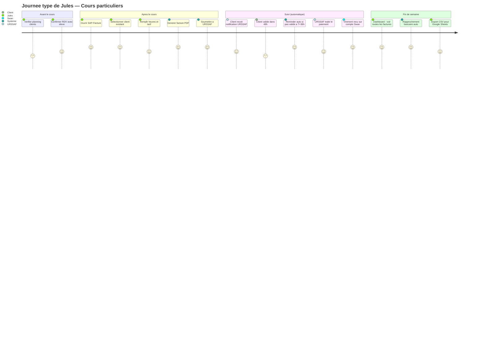

# 1. Parcours Utilisateur Quotidien

> Le workflow type de Jules : du cours donne au paiement recu sur son compte.

---

---

## Explications

| Etape | Qui | Quoi |
|-------|-----|------|
| Avant le cours | Jules | Verifie son planning, confirme avec l'eleve |
| Apres le cours | Jules | Ouvre l'app, selectionne le client, saisit heures + tarif |
| Generation | Systeme | PDF pro avec logo, soumission automatique a URSSAF |
| Validation | Client | Recoit un email URSSAF, valide en ligne (48h max) |
| Reminder | Systeme | Si pas de validation a T+36h, email auto a Jules pour relancer |
| Paiement | URSSAF + Client | 50% credit impot URSSAF + 50% reste a charge client |
| Rapprochement | Systeme | Match auto virements Swan avec factures soumises |
| Export | Jules | CSV export pour Google Sheets, controle hebdo |
