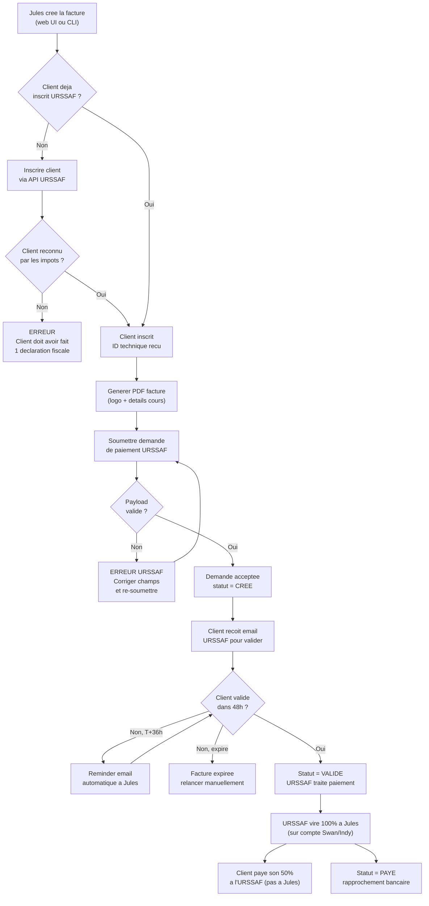

# 2. Flux de Facturation End-to-End

> De la creation de la facture jusqu'au paiement recu et rapproche.

---

---

## Legende

| Couleur | Signification |
|---------|---------------|
| Bleu | Action de Jules |
| Violet | Generation automatique |
| Vert | Succes / progression |
| Orange | Warning / attente |
| Rouge | Erreur / blocage |

## Points cles

- **Inscription client** : obligatoire une seule fois par client, necessite que le client ait fait au moins 1 declaration fiscale
- **Validation 48h** : le client a 48h pour valider la facture sur le portail URSSAF, sinon elle expire
- **Reminder T+36h** : le systeme previent Jules 12h avant expiration pour qu'il relance le client
- **Paiement unique** : URSSAF verse 100% a Jules sur Swan. Le client paye son 50% reste a charge directement a l'URSSAF (jamais a Jules)
- **Rapprochement** : 1 facture = 1 virement URSSAF a matcher sur Swan
