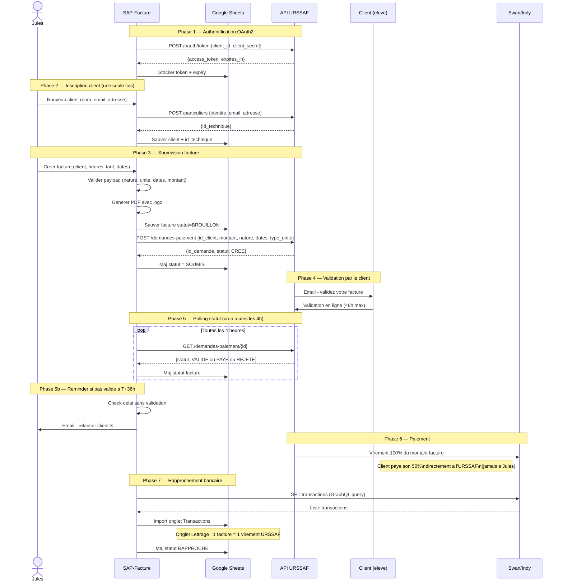

# 3. Sequence API URSSAF — Appels Techniques

> Diagramme de sequence montrant chaque appel API entre SAP-Facture, l'API URSSAF, Swan et les autres acteurs.

---



---

## Detail des endpoints URSSAF

| Phase | Methode | Endpoint | Payload | Reponse |
|-------|---------|----------|---------|---------|
| Auth | POST | `/oauth/token` | `client_id`, `client_secret`, `grant_type=client_credentials` | `access_token`, `expires_in` |
| Inscription | POST | `/particuliers` | `identite` (nom, prenom), `email`, `adresse` | `id_technique` |
| Soumission | POST | `/demandes-paiement` | `id_client`, `montant`, `nature_code`, `date_debut`, `date_fin`, `type_unite` | `id_demande`, `statut` |
| Statut | GET | `/demandes-paiement/{id}` | - | `statut`, `info_rejet`, `info_virement` |
| Annulation | DELETE | `/demandes-paiement/{id}` | - | confirmation |

## Detail Swan GraphQL

```graphql
query GetTransactions($accountId: ID!, $after: DateTime) {
  account(id: $accountId) {
    transactions(filter: { afterDate: $after }) {
      edges {
        node {
          id
          amount { value currency }
          label
          bookingDate
          side  # Credit ou Debit
        }
      }
    }
  }
}
```

## Notes techniques

- **Token OAuth** : expire apres `expires_in` secondes, auto-refresh avant expiration
- **Rate limit** : pas documente officiellement, implementer retry avec backoff exponentiel
- **Sandbox** : tester tous les appels en sandbox avant production
- **NOVA** : le numero `SAP991552019` est utilise comme identifiant intervenant dans chaque facture
