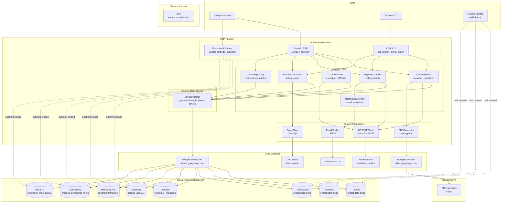

# 4. Architecture Systeme

> Vue haut-niveau de tous les composants et leurs interactions. Monolith FastAPI + Google Sheets comme backend data.

---

---

## Stack technique

| Couche | Technologie | Role |
|--------|-------------|------|
| Web Framework | FastAPI | SSR, routes HTTP, API interne |
| Templates | Jinja2 | Rendu HTML server-side |
| Styling | Tailwind CSS (CDN) | Pas de build step |
| CLI | Click | Commandes terminal |
| Data Backend | Google Sheets API v4 | Stockage, formules, reporting |
| Sheets Client | gspread + google-auth | Lecture/ecriture sheets Python |
| PDF | weasyprint | HTML → PDF, logo |
| Stockage PDF | Google Drive API v3 | Upload PDFs, partage liens |
| HTTP | httpx | Async, OAuth2 URSSAF |
| GraphQL | gql | Queries Swan |
| Crypto | cryptography.Fernet | Chiffrement secrets locaux |
| Scheduler | APScheduler | Cron polling 4h |
| Env | pydantic-settings | Validation .env |

## Pourquoi Google Sheets

- **Jules peut voir et editer** les donnees brutes directement dans Sheets
- **Formules natives** pour le lettrage et les balances — pas de code custom
- **Partage comptable** — un lien et le comptable a acces en lecture
- **Zero infrastructure** — pas de DB a maintenir, backup auto Google
- **Reporting NOVA** — les metriques trimestrielles se calculent en formules
- **Embed iframe** — les onglets calcules s'affichent directement dans le dashboard FastAPI

## Dashboard iframes Google Sheets

Les onglets calcules sont embarques dans le dashboard FastAPI via "Publier sur le web" (Google Sheets → Fichier → Partager → Publier sur le web).

**URL embed** : `https://docs.google.com/spreadsheets/d/{SPREADSHEET_ID}/pubhtml?gid={SHEET_GID}&single=true`

| Onglet | Mode | Raison |
|--------|------|--------|
| Lettrage | iframe embed (lecture) | Formules live, pas d'edit |
| Balances | iframe embed (lecture) | Soldes calcules |
| Metrics NOVA | iframe embed (lecture) | Reporting trimestriel |
| Cotisations | iframe embed (lecture) | Charges mensuelles |
| Fiscal IR | iframe embed (lecture) | Simulation impot |
| Clients | lien direct Sheet | Saisie manuelle |
| Factures | lien direct Sheet | Saisie + suivi |
| Transactions | lien direct Sheet | Import Swan |

**Comportement** :
- Auto-refresh toutes les 5 min (natif Google)
- Lecture seule dans l'iframe — les formules tournent dans Sheets
- Pour editer un onglet brut, Jules clique un lien qui ouvre le vrai Sheet
- Zero JS custom — juste un `<iframe>` dans le template Jinja2

## Principes

- **Monolith** : un seul process FastAPI, pas de microservices
- **Sheets = source de verite** : les 3 onglets data brute sont la reference
- **Iframe dashboard** : les 5 onglets calcules sont affiches en embed pubhtml dans FastAPI
- **Protection des donnees** : onglets bruts proteges (edit sous condition), onglets calcules en lecture seule
- **Adapter pattern** : `SheetsAdapter` encapsule toute l'interaction Google Sheets API
- **Pas de frontend JS** : tout est SSR + iframes Sheets, zero build step Node.js
