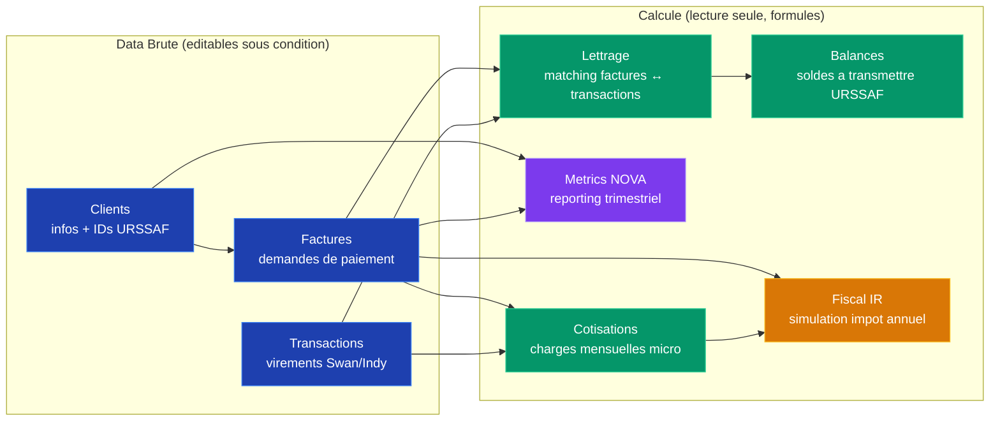

# 5. Modele de Donnees — Google Sheets

> Structure des onglets Google Sheets : 3 onglets de data brute + 5 onglets calcules.

---

## Vue d'ensemble des onglets

---

## Onglet 1 : Clients

| Colonne | Type | Description | Exemple |
|---------|------|-------------|---------|
| client_id | string | Identifiant unique (auto) | CLI-001 |
| nom | string | Nom de famille | Dupont |
| prenom | string | Prenom | Marie |
| email | string | Email client | marie@gmail.com |
| telephone | string | Telephone | 06 12 34 56 78 |
| adresse | string | Adresse postale | 12 rue des Lilas |
| code_postal | string | Code postal | 75011 |
| ville | string | Ville | Paris |
| urssaf_id | string | ID technique URSSAF (recu apres inscription) | TP-12345 |
| statut_urssaf | enum | INSCRIT / ACTIF / ERREUR | ACTIF |
| date_inscription | date | Date d'inscription URSSAF | 2026-03-10 |
| actif | bool | Client actif (TRUE/FALSE) | TRUE |

**Protection** : colonnes `urssaf_id` et `statut_urssaf` ecrites uniquement par l'app (pas d'edit manuel).

---

## Onglet 2 : Factures

| Colonne | Type | Description | Exemple |
|---------|------|-------------|---------|
| facture_id | string | Identifiant unique | SAP-2026-0001 |
| client_id | ref | Reference vers onglet Clients | CLI-001 |
| client_nom | formule | =VLOOKUP auto | Marie Dupont |
| type_unite | enum | HEURE / FORFAIT | HEURE |
| nature_code | string | Code nature URSSAF | COURS_PARTICULIERS |
| quantite | number | Nb heures ou 1 forfait | 2 |
| montant_unitaire | currency | Prix unitaire | 35.00 |
| montant_total | formule | =quantite * montant_unitaire | 70.00 |
| date_debut | date | Debut intervention | 2026-03-10 |
| date_fin | date | Fin intervention (meme mois) | 2026-03-10 |
| description | string | Detail prestation | Cours maths 2nde |
| statut | enum | BROUILLON / SOUMIS / CREE / EN_ATTENTE / VALIDE / PAYE / RAPPROCHE / ANNULE | VALIDE |
| urssaf_demande_id | string | ID demande paiement URSSAF | DP-67890 |
| date_soumission | date | Date envoi URSSAF | 2026-03-10 |
| date_validation | date | Date validation client | 2026-03-11 |
| date_paiement | date | Date virement URSSAF | 2026-03-14 |
| montant_credit_impot | formule | =montant_total * 50% | 35.00 |
| montant_reste_charge | formule | =montant_total * 50% | 35.00 |
| motif_rejet | string | Raison si rejete | (vide) |
| pdf_drive_id | string | ID fichier Google Drive | 1a2b3c4d5e... |
| intervenant_nova | string | Toujours SAP991552019 | SAP991552019 |

**Protection** : colonnes `urssaf_demande_id`, `statut` (sauf BROUILLON), dates de suivi ecrites par l'app.

---

## Onglet 3 : Transactions

| Colonne | Type | Description | Exemple |
|---------|------|-------------|---------|
| transaction_id | string | ID unique | TXN-001 |
| swan_id | string | ID transaction Swan | swn_abc123 |
| date_valeur | date | Date valeur du virement | 2026-03-14 |
| montant | currency | Montant (positif = credit) | 35.00 |
| libelle | string | Libelle bancaire | VIR URSSAF SAP |
| type | enum | CREDIT / DEBIT | CREDIT |
| source | enum | URSSAF / AUTRE | URSSAF |
| facture_id | ref | Ref facture si rapproche | SAP-2026-0001 |
| statut_lettrage | enum | NON_LETTRE / LETTRE / IGNORE | LETTRE |
| date_import | date | Date d'import Swan | 2026-03-14 |

**Protection** : donnees importees par l'app depuis Swan. `facture_id` et `statut_lettrage` modifiables apres verification.

---

## Onglet 4 : Lettrage (formules)

Cet onglet fait le matching automatique entre Factures et Transactions.

| Colonne | Type | Description |
|---------|------|-------------|
| facture_id | ref | Reference facture |
| montant_facture | formule | Total facture |
| txn_id | formule | Transaction URSSAF matchee (100% montant, libelle contient "URSSAF") |
| txn_montant | formule | Montant du virement URSSAF |
| ecart | formule | montant_facture - txn_montant |
| score_confiance | formule | Score de matching (montant +50, date +30, libelle +20) |
| statut_lettrage | formule | AUTO (>= 80) / A_VERIFIER (< 80) / PAS_DE_MATCH |

**Logique des formules** :
- `FILTER` + `MATCH` pour trouver les transactions dans la fenetre +/- 5 jours de la date_paiement
- `ABS(montant_txn - montant_facture) < 0.01` pour le matching montant exact (URSSAF paye 100%)
- Score = somme ponderee des criteres

---

## Onglet 5 : Balances

Vue consolidee des soldes pour declaration URSSAF.

| Colonne | Type | Description |
|---------|------|-------------|
| mois | date | Mois concerne |
| nb_factures | formule | Nombre de factures du mois |
| ca_total | formule | CA total du mois |
| recu_urssaf | formule | Total virements URSSAF recus |
| solde | formule | ca_total - recu_urssaf (ecart) |
| nb_non_lettrees | formule | Factures sans rapprochement |
| nb_en_attente | formule | Factures en attente validation client |

---

## Onglet 6 : Metrics NOVA

Donnees pre-calculees pour la declaration trimestrielle sur nova.entreprises.gouv.fr.

| Colonne | Type | Description |
|---------|------|-------------|
| trimestre | string | T1-2026, T2-2026, etc. |
| nb_intervenants | formule | Toujours 1 (Jules) |
| dont_salaries | formule | Toujours 0 (micro) |
| heures_effectuees | formule | SUM heures du trimestre (arrondi sup) |
| nb_particuliers | formule | COUNTUNIQUE clients du trimestre |
| masse_salariale | formule | Toujours 0 (micro) |
| ca_trimestre | formule | SUM CA du trimestre |
| nb_factures | formule | COUNT factures du trimestre |
| deadline_saisie | string | Date limite (debut mois suivant le trimestre) |

**Usage** : Jules ouvre cet onglet, copie les valeurs, et les saisit manuellement sur nova.entreprises.gouv.fr (pas d'API NOVA disponible).

---

## Onglet 7 : Cotisations

Calcul des charges sociales mensuelles micro-entrepreneur BNC a declarer sur autoentrepreneur.urssaf.fr.

| Colonne | Type | Description | Exemple |
|---------|------|-------------|---------|
| mois | date | Mois concerne | 2026-03 |
| ca_encaisse | formule | CA encaisse du mois (SUM virements URSSAF recus) | 1200.00 |
| taux_charges | number | Taux total (cotisations 25.6% + CFP 0.2%) | 25.8 |
| montant_charges | formule | =ca_encaisse * taux_charges% | 309.60 |
| date_limite | formule | Dernier jour du mois suivant | 2026-04-30 |
| statut | enum | A_DECLARER / DECLARE / PAYE | A_DECLARER |
| cumul_ca_annuel | formule | Cumul CA depuis janvier | 3600.00 |
| cumul_charges | formule | Cumul charges payees depuis janvier | 928.80 |
| net_apres_charges | formule | =ca_encaisse - montant_charges | 890.40 |

**Taux 2026 BNC hors CIPAV** : cotisations sociales 25.6% (decret n°2025-943) + CFP 0.2% = **25.8%** total. Pas de CFE a payer.

**Protection** : `taux_charges` editable par Jules (ajuster si changement de taux). `statut` mis a jour manuellement apres declaration.

**Usage** : Jules ouvre cet onglet en fin de mois, verifie le CA encaisse, et declare sur autoentrepreneur.urssaf.fr. Le montant a payer est pre-calcule.

---

## Onglet 8 : Fiscal IR

Simulation annuelle de l'impot sur le revenu. Combine revenus apprentissage (exoneres jusqu'au SMIC annuel) + revenus micro-entreprise BNC (abattement 34%) pour determiner la tranche marginale.

| Colonne | Type | Description | Exemple |
|---------|------|-------------|---------|
| annee | string | Annee fiscale | 2026 |
| revenu_apprentissage_brut | number | Revenu brut apprentissage (saisie manuelle) | 18000.00 |
| seuil_exoneration_apprenti | number | Seuil exoneration = SMIC annuel net | 21273.00 |
| revenu_apprentissage_imposable | formule | =MAX(0, brut - seuil) | 0.00 |
| ca_micro_annuel | formule | =SUM(Cotisations.ca_encaisse) sur l'annee | 14400.00 |
| abattement_micro_pct | number | Abattement BNC (%) | 34 |
| revenu_micro_imposable | formule | =ca_micro * (1 - abattement%) | 9504.00 |
| cotisations_payees | formule | =SUM(Cotisations.montant_charges) sur l'annee | 3715.20 |
| revenu_total_imposable | formule | =apprentissage_imposable + micro_imposable | 9504.00 |
| nb_parts | number | Nombre de parts fiscales | 1 |
| quotient_familial | formule | =revenu_total / nb_parts | 9504.00 |
| ir_tranche_0 | formule | 0% jusqu'a 11 497 EUR | 0.00 |
| ir_tranche_11 | formule | 11% de 11 497 a 29 315 EUR | 0.00 |
| ir_tranche_30 | formule | 30% de 29 315 a 83 823 EUR | 0.00 |
| ir_tranche_41 | formule | 41% de 83 823 a 180 294 EUR | 0.00 |
| ir_tranche_45 | formule | 45% au-dela de 180 294 EUR | 0.00 |
| impot_brut | formule | =SUM(tranches) * nb_parts | 0.00 |
| taux_marginal | formule | Tranche la plus haute applicable | 0% |
| taux_moyen | formule | =impot_brut / revenu_total * 100 | 0.0% |
| simulation_vl | formule | =ca_micro * 2.2% (versement liberatoire BNC) | 316.80 |
| ecart_vl_vs_ir | formule | =impot_brut - simulation_vl | -316.80 |
| recommandation | formule | "VL avantageux" si ecart > 0, sinon "IR classique" | IR classique |

**Taux 2026** : abattement BNC = 34% (minimum 305 EUR). VL = 2.2%. Seuil RFR pour eligibilite VL = 27 478 EUR par part.

**Saisie manuelle** : `revenu_apprentissage_brut`, `seuil_exoneration_apprenti`, `nb_parts`. Les tranches IR sont ajustees chaque annee par la loi de finances.

**Usage** : Jules remplit son revenu apprentissage en debut d'annee (ou a chaque fiche de paie). L'onglet calcule automatiquement dans quelle tranche il se situe et si le versement liberatoire est avantageux.
