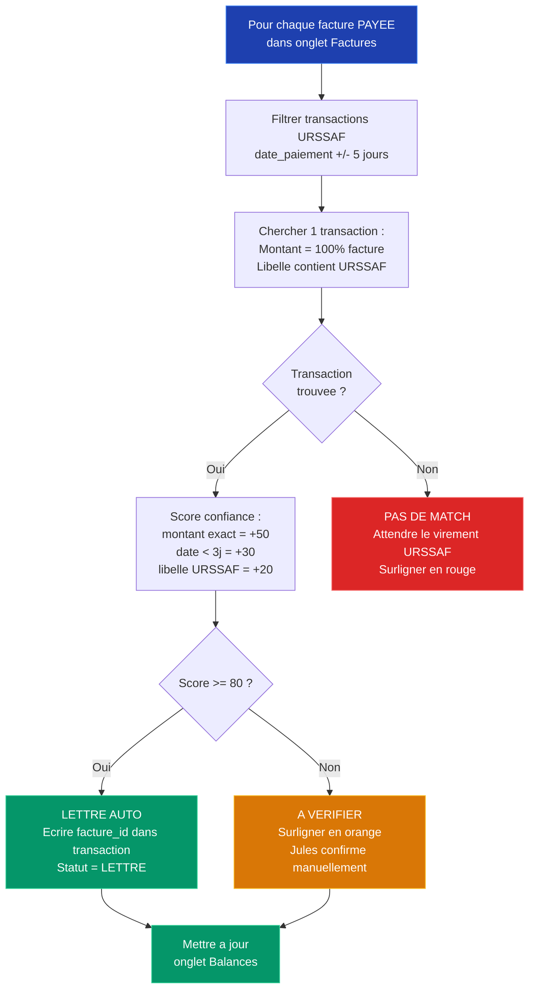
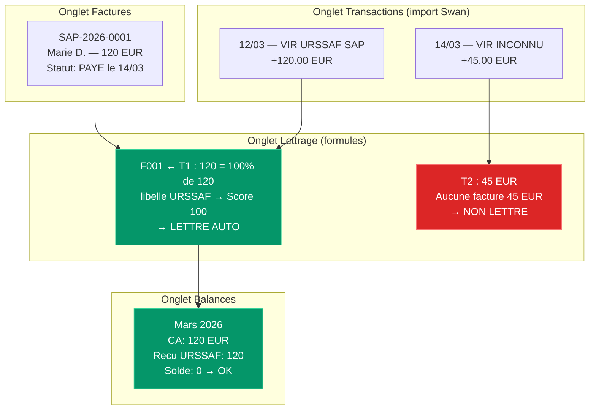

# 6. Rapprochement Bancaire & Lettrage — Swan / URSSAF

> Comment le systeme matche automatiquement les virements URSSAF recus sur Swan
> avec les factures. L'URSSAF paye 100% a Jules. Le client paye son reste a charge
> directement a l'URSSAF (jamais a Jules). Tout se passe dans Google Sheets.

---

## Vue d'ensemble du flux

```mermaid
flowchart LR
    subgraph "Sources"
        U["API URSSAF\nStatut factures"]
        S["API Swan\nTransactions bancaires"]
    end

    subgraph "SAP-Facture (App)"
        SYNC["Sync Service\n(cron 4h)"]
    end

    subgraph "Google Sheets"
        GF["Onglet Factures\nmaj statuts"]
        GT["Onglet Transactions\nimport virements"]
        GL["Onglet Lettrage\nformules matching"]
        GB["Onglet Balances\nsoldes calcules"]
    end

    subgraph "Resultat"
        OK["LETTRE\nFacture + virement OK"]
        WAIT["EN ATTENTE\nPas encore paye"]
        MANUAL["A VERIFIER\nScore < 80%"]
    end

    U --> SYNC
    S --> SYNC
    SYNC --> GF
    SYNC --> GT
    GF --> GL
    GT --> GL
    GL --> GB
    GL --> OK
    GL --> WAIT
    GL --> MANUAL
```

---

## Algorithme de lettrage (formules Sheets)

---

## Exemple concret dans Sheets

---

## Regles de matching

| Critere | Points | Detail |
|---------|--------|--------|
| Montant exact (100% facture) | +50 | Transaction = exactement le total facture |
| Date proche (< 3 jours du statut PAYE) | +30 | Plus la date est proche, plus le score est haut |
| Libelle contient "URSSAF" | +20 | Confirme que c'est bien un virement URSSAF |
| **Seuil auto-lettrage** | **>= 80** | En dessous = surligne orange pour verification manuelle |

## Mise en forme conditionnelle Sheets

| Couleur | Signification |
|---------|---------------|
| Vert | Lettre automatiquement (score >= 80) |
| Orange | A verifier manuellement (score 50-79) |
| Rouge | Pas de match — transaction orpheline ou virement pas encore recu |

## Cas speciaux

- **Transaction orpheline** : virement recu sans facture correspondante → flag rouge, verification manuelle
- **Retard URSSAF** : le virement URSSAF peut arriver 2-5 jours apres le statut PAYE → tolerance temporelle elargie
- **Edit manuel** : Jules peut forcer un lettrage dans l'onglet Transactions en mettant le facture_id a la main
