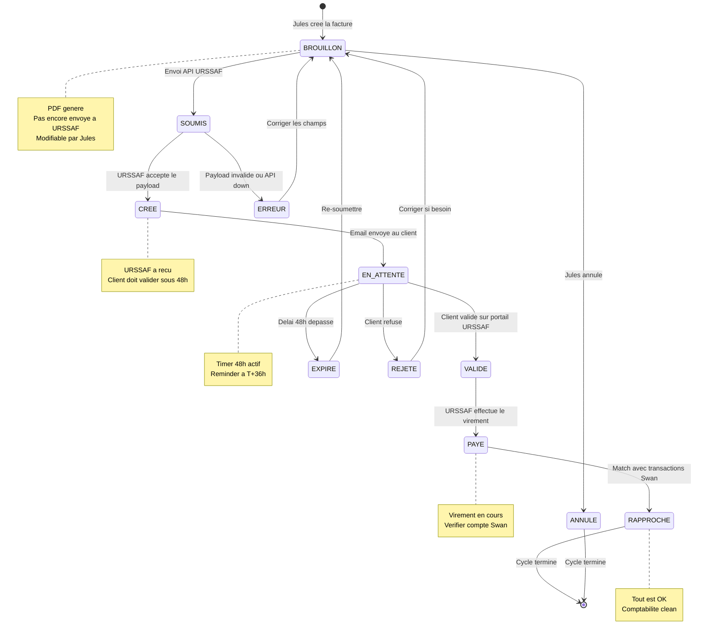

# 7. Cycle de Vie Facture — Machine a Etats

> Tous les statuts possibles d'une facture et les transitions entre eux.

---

---

## Detail de chaque statut

| Statut | Qui agit | Description | Duree typique |
|--------|----------|-------------|---------------|
| **BROUILLON** | Jules | Facture creee, PDF genere, modifiable | Quelques minutes |
| **SOUMIS** | Systeme | Envoyee a URSSAF via API | Instantane |
| **ERREUR** | Systeme | URSSAF a rejete le payload | — |
| **CREE** | URSSAF | Demande de paiement acceptee, email envoye au client | < 1 min |
| **EN_ATTENTE** | Client | Le client doit valider sur le portail URSSAF | 0 - 48h |
| **VALIDE** | Client | Le client a confirme, URSSAF traite le paiement | Quelques heures |
| **PAYE** | URSSAF | Virement effectue vers Swan/Indy | 2 jours apres validation |
| **RAPPROCHE** | Systeme | Les virements ont ete matches avec la facture | Auto ou manuel |
| **EXPIRE** | Timer | Le client n'a pas valide dans les 48h | — |
| **REJETE** | Client | Le client a refuse la facture | — |
| **ANNULE** | Jules | Jules a annule la facture avant soumission | — |

## Transitions critiques

### SOUMIS → ERREUR
Causes possibles :
- Champ manquant (nature_code, dates, montant)
- Format incorrect (date_fin avant date_debut, periode > 1 mois)
- Client pas inscrit ou desactive
- Token OAuth expire (auto-refresh devrait eviter ca)

### EN_ATTENTE → EXPIRE
- Le client a 48h pour valider
- A T+36h : reminder automatique envoye a Jules
- A T+48h : facture passe en EXPIRE, Jules peut re-soumettre

### PAYE → RAPPROCHE
- Le systeme cherche 2 virements sur Swan :
  - 1 virement URSSAF (50% credit impot)
  - 1 virement client (50% reste a charge)
- Si les 2 sont trouves avec score > 80% → auto-rapprochement
- Sinon → suggestion manuelle a Jules
