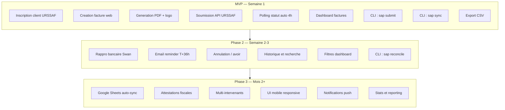

# 8. Scope MVP vs Phases Futures

> Ce qui est dans le MVP (semaine 1) vs ce qui vient apres.

---

---

## Detail MVP — Semaine 1

| Fonctionnalite | Priorite | Effort | Valeur |
|----------------|----------|--------|--------|
| Inscription client URSSAF | P0 | 0.5j | Bloquant - sans ca rien ne marche |
| Creation facture (formulaire web) | P0 | 1j | Core feature |
| Generation PDF avec logo | P0 | 0.5j | Facture pro pour les clients |
| Soumission API URSSAF | P0 | 1j | La raison d'etre du projet |
| Polling statut (cron 4h) | P0 | 0.5j | Savoir ou en sont les factures |
| Dashboard liste factures | P1 | 0.5j | Vue d'ensemble |
| CLI submit + sync | P1 | 0.5j | Automation rapide |
| Export CSV | P2 | 0.5j | Controle Google Sheets |

## Detail Phase 2 — Semaine 2-3

| Fonctionnalite | Priorite | Effort | Valeur |
|----------------|----------|--------|--------|
| Rappro bancaire Swan | P1 | 1.5j | Savoir si on est bien paye |
| Email reminder T+36h | P1 | 0.5j | Eviter les factures expirees |
| Annulation / avoir | P2 | 1j | Gerer les erreurs |
| Historique + recherche | P2 | 0.5j | Retrouver une facture |
| Filtres dashboard | P2 | 0.5j | Trier par statut, client, date |

## Detail Phase 3 — Mois 2+

| Fonctionnalite | Priorite | Effort | Valeur |
|----------------|----------|--------|--------|
| Google Sheets auto-sync | P2 | 1j | Plus besoin d'upload CSV |
| Attestations fiscales | P2 | 1.5j | Obligations legales annuelles |
| Multi-intervenants | P3 | 2j | Si Jules embauche |
| UI mobile responsive | P3 | 1j | Facturer depuis le telephone |
| Stats et reporting | P3 | 1.5j | CA mensuel, nb clients, etc. |
