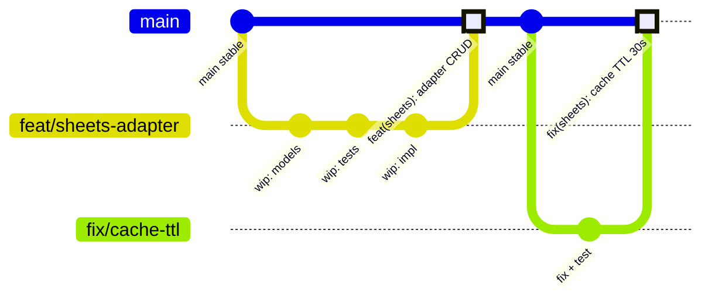

# Strategie de Branches — SAP-Facture

> Ref: FURPS+ S-04 | Decision D9 | [MPP-37](https://linear.app/pmm-001/issue/MPP-37)

## Principe

**Trunk-based development** : `main` est toujours stable et deployable.

Les feature branches sont **courtes** (< 3 jours) et mergees via PR uniquement.

## Convention de Nommage

| Prefixe | Usage | Exemple |
|---------|-------|---------|
| `feat/` | Nouvelle fonctionnalite | `feat/sheets-adapter` |
| `fix/` | Correction de bug | `fix/cache-ttl` |
| `integ/` | Integration entre modules | `integ/ais-sheets-sync` |
| `refactor/` | Restructuration sans changement fonctionnel | `refactor/models-v2` |

## Regles

1. **Jamais de push direct sur `main`** — toujours via Pull Request
2. **Squash merge par defaut** — historique propre, un commit par PR
3. **Branches < 3 jours** — decouper si la feature est plus large
4. **Supprimer la branche** apres merge

## Flux Git

## Checklist PR

Avant de merger, chaque PR doit satisfaire :

- [ ] Tests green (`uv run pytest --cov=src --cov-fail-under=80`)
- [ ] Linting clean (`uv run ruff check src/ tests/`)
- [ ] Types clean (`uv run pyright --strict src/`)
- [ ] Description claire du changement
- [ ] Reference issue Linear (ex: `Closes MPP-XX`)
